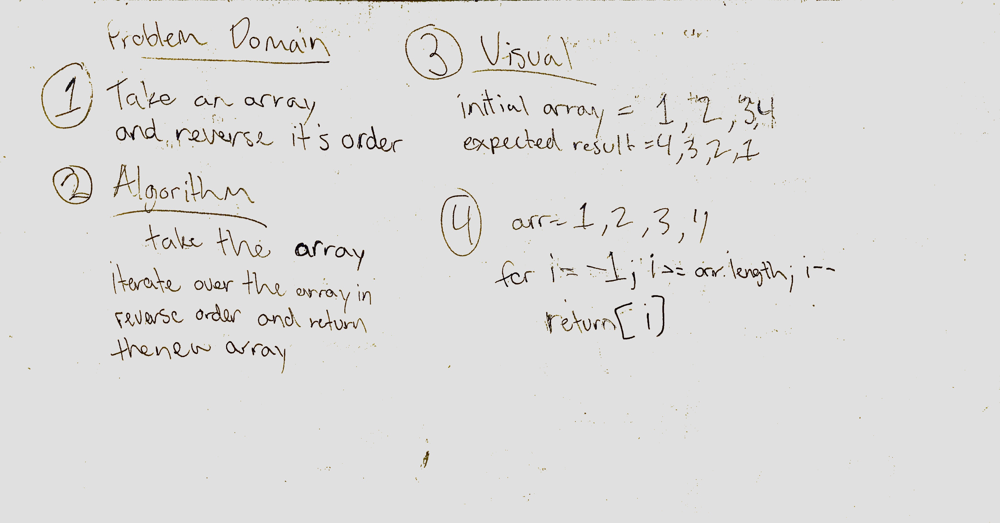
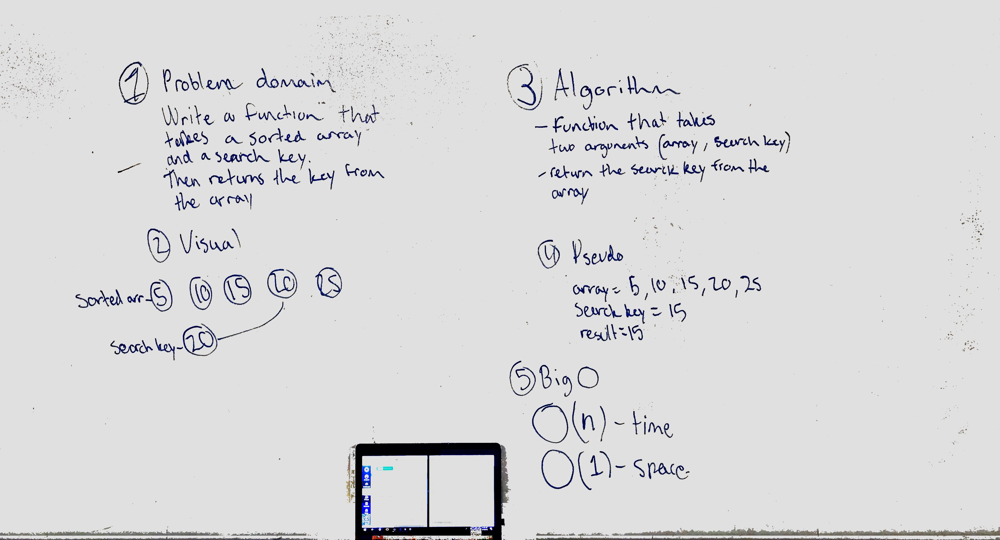
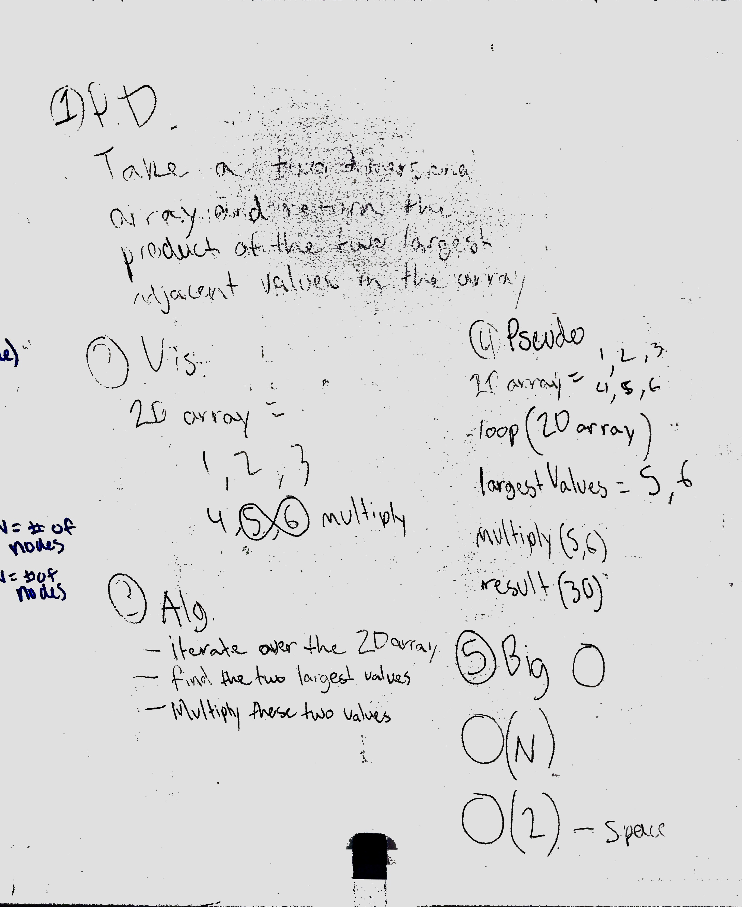
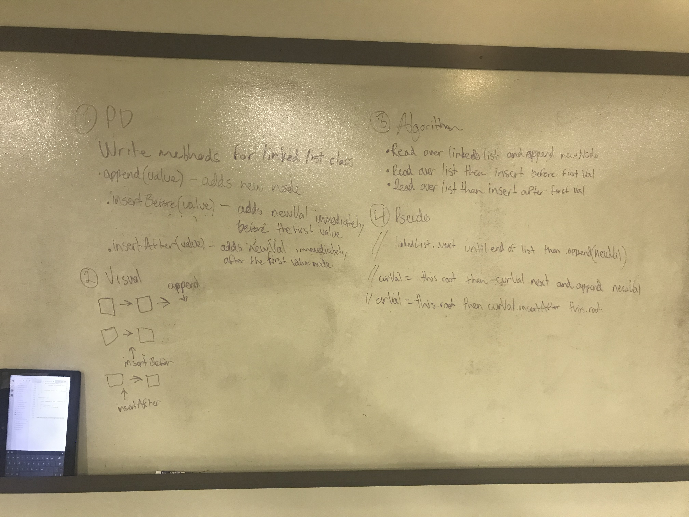
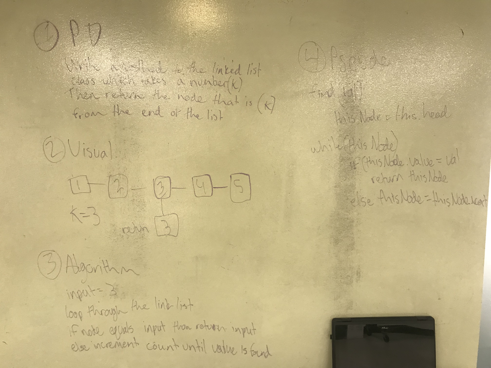
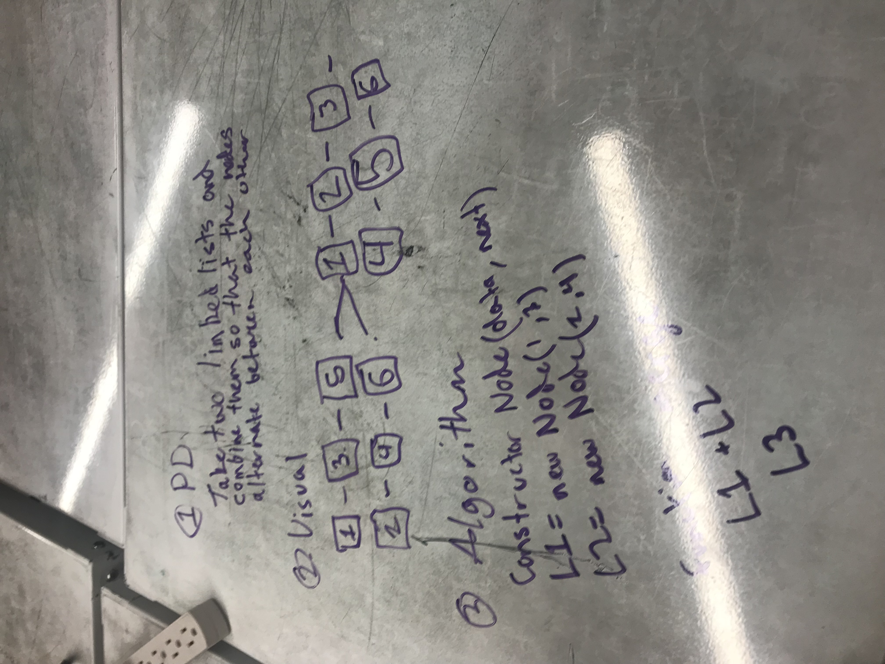
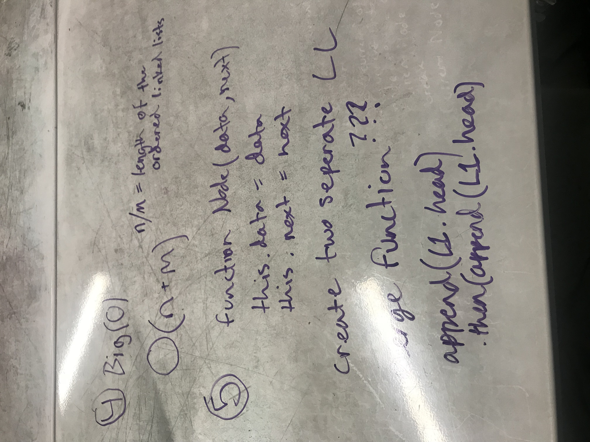

### Reverse an Array
Reverse array method will take in an array in as an argument and return the array in reverse.

Challenge
avoid using built in Javascript methods.

### Array Shift
Take an input value and insert it into the middle of a given array

Challenge 
Finding the middle of an array

### Array Binary Search
Search a sorted array and find the middle return the value

Challenge
Binary Algorithms

### Array Adjacent Product 
Take a 2D array and find it's two largest products and multiply them to find their product 

### ll_insertions 
Write methods in insert a node into a linked list at various points of the list

### ll_kth_from_end
Write a method that finds the value of node specified by a input

### ll_merge
Write a method that merges two linked lists at alternating nodes

### ll_detect_loop
Write a method that detects a loop withing a singly linked list

