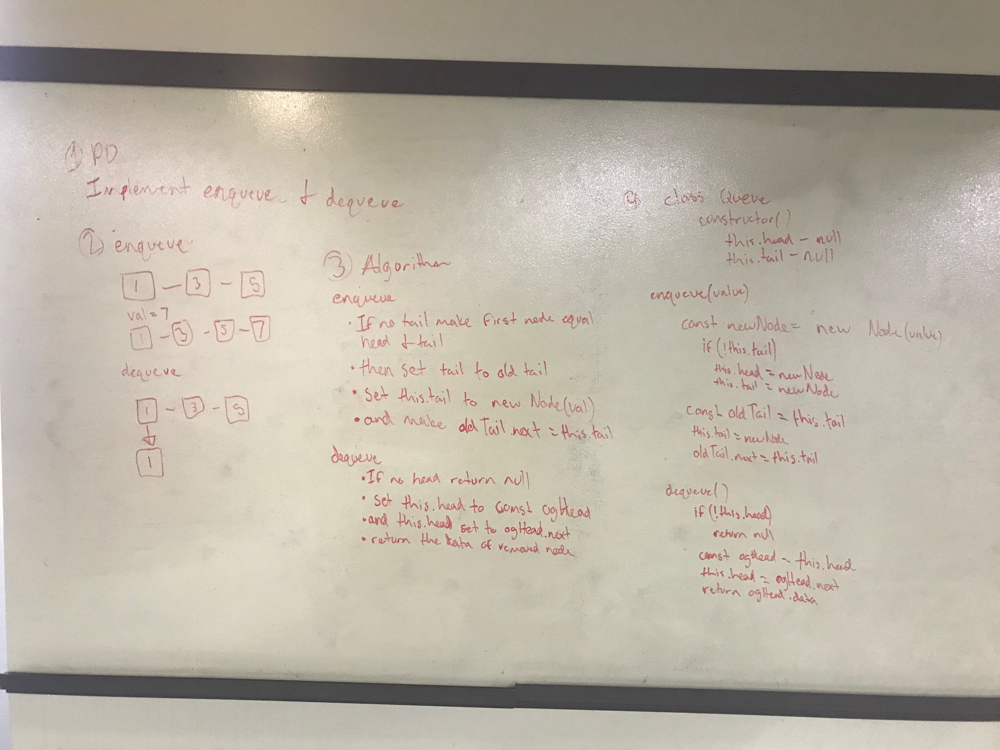
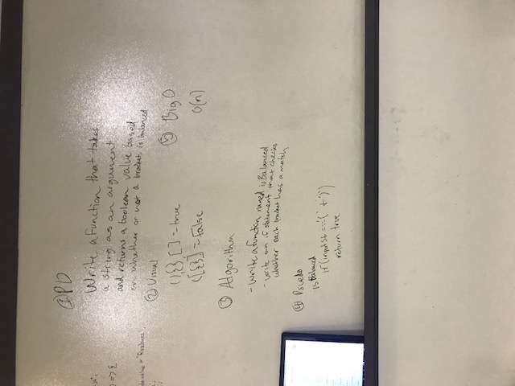
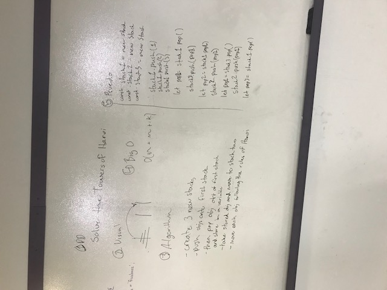

### enqueue and dequeue
Write an enqueue and dequeue method on a queue

### multi-bracket validation
Your function should take a string as its only argument, and should return a boolean representing whether or not the brackets in the string are balanced. There are 3 types of brackets: (), {}, []

### Towers of Hanoi
Solve the Towers if Hanoi using a stack method

